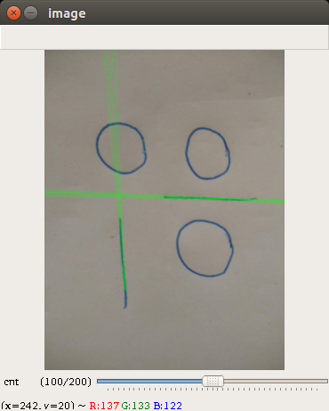
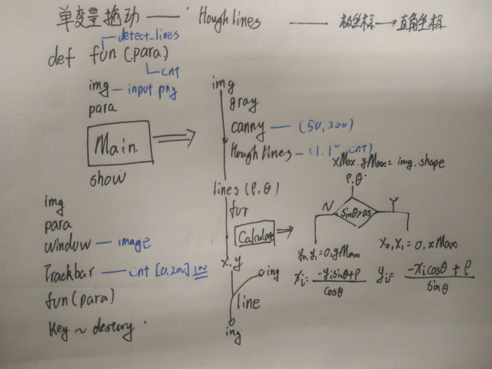

用Hough变换来检测直线
==
##Usge
* 执行:` python2 hough_lines.py`
* 结果如下:

* cnt变量是Hough变换中的一个阈值参数, cnt=100 意味着超过100个像素点满足同一直线规律才能够认为确实存在一条直线. 可见cnt越小, 则判断出的线越多.

##Principle
* 首先对图片进行二值化(每个像素点只能是0和1)
* 每一条直线可以唯一的用(rho, theta) 表示
* 遍历每一个值为1的像素点, 给有可能经过该点的所有(rho, theta)组合投一票
* 对于任意一个(rho, theta)对, 当它被投了超过cnt(自己设的参数) 时, 就被认为存在, 并且将rho, theta 返回
* 另外还需设置rho, theta 的量化精度

##Structure
* 这个恐怕只有我能看懂, 黑色代表框架, 蓝色代表修改项

##Reference
<http://blog.csdn.net/on2way/article/details/47028969A>
<https://www.cnblogs.com/denny402/p/5158707.html>
